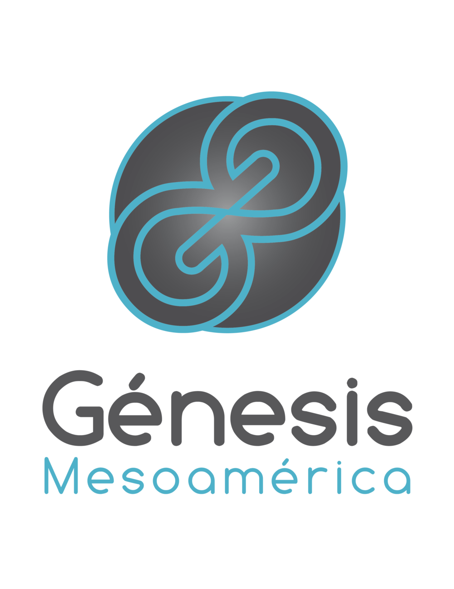

# Genesis Social Network Project

Red Social para Proyecto Génesis de La Iglesia del Nazareno basado en **NodeJS, Mongo DB y Angularjs 1**

####Requisitos Previos

######Node JS:
* .tar.gz o .exe 

	`https://nodejs.org/en/download/`

* Por Manejador de Paquetes (Solo Linux)

	`https://nodejs.org/en/download/package-manager/`
    
######NPM (Manejador de Paquetes de Node):

Junto con la instalación de node viene npm, solo debes de asegurarte que la versión de npm sea mayor a 2.1.8

`npm -v`

O instala la ultima actualización

`npm install npm -g`

######Mongo DB
Instala según tu distribución (Windows, Linux, OS X)

`https://docs.mongodb.com/manual/installation/`

####Primeros Pasos

######Instalación de Paquetes
Basta con ejecutar:

` sudo npm install`

######Puesta en Marcha

Para iniciar el servidor se utiliza el siguiente comando:

`npm run start`

* Por default el servidor corre por el puerto 1234

* Asegurate de todo hacerlo dentro del directorio raíz de tu proyecto.

